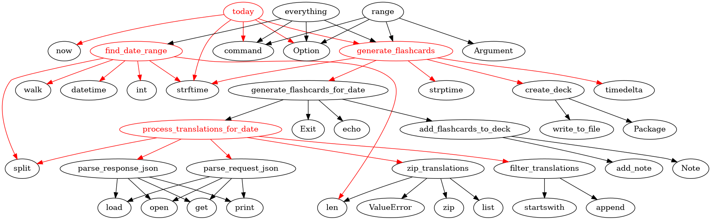

# pikkugraph - visualize which Python functions depend on which other Python functions

Best for short (100-300) line Python scripts. For example,

```bash
python main.py example/selkokortti.py
```

will print `example/selkokortti.dot` to stdout, and `example/selkokortti.dot` will create a graph like



.

The red color means there are more than 4 outgoing arrows, [which might be a good candidate for refactoring](https://hiandrewquinn.github.io/til-site/posts/the-rule-of-four/). See for example our very own script, which is awful:


## Motivation

I was just curious! Other tools like this 100% exist, I just don't know where they are or how to use them. This is the simplest possible version of one I could make.
